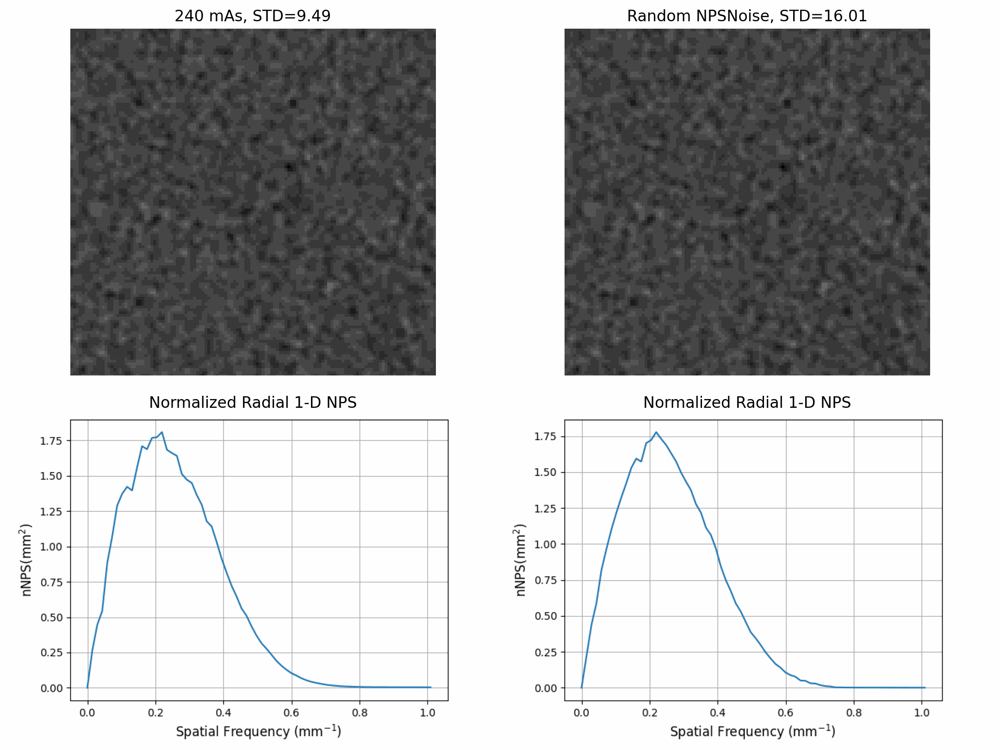
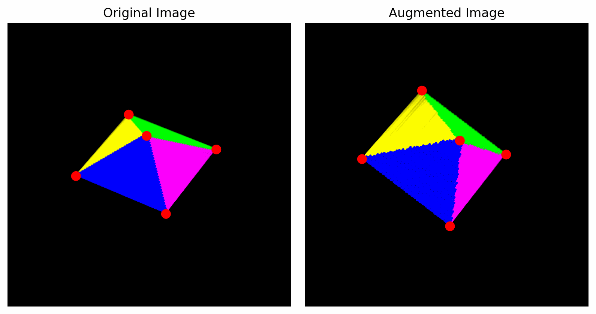

# DICaugment
<!-- [](https://badge.fury.io/py/albumentations)
 -->

DICaugment is a Python package based on the popular image augmentation library [Albumentations](https://github.com/albumentations-team/albumentations) [[1]](#1), but with specific enhancements for working with volumetric 3D images, such as CT scans. This package provides a collection of powerful and efficient augmentation techniques that can be seamlessly integrated into your machine learning pipeline to augment 3D images.


Below are some examples of some common or unique augmentations that are possible with the DICaugment library applied on an example obtained from the NLST dataset [[2]](#2):


## Features

dicaugment offers the following key features:

- 3D-specific augmentation techniques: The package includes a variety of augmentation methods specifically designed for volumetric 3D images, such as CT scans. These techniques can be used to augment data and improve model generalization. The package was designed to incorporate the metadata availble in DICOM headers, allowing users to create transformations that are consistent with an image's acquisition parameters.

- Seamless integration: The package is built as an extension of the Albumentations library, making it easy to incorporate 3D augmentation into your existing image processing pipelines. It maintains a similar API and workflow, ensuring a smooth transition for users already familiar with Albumentations.

- Flexibility: DICaugment is designed to be flexible, allowing users to create custom augmentation pipelines tailored to their specific needs. The modular architecture of the package makes it easy create long and complex augmentation pipelines suitable for their needs.


## Key Differences between DICaugment and Albumentations

- **Dimensionality** is a key difference as Albumentations and most other augmentation libraries do not support volumetric images while DICaugment is specifically tailored for these types of images

- The **backbone** of Albumentations mainly relies on operations in the [openCV](https://opencv.org/) framework while DICaugment relies on [SciPy](https://scipy.org/). As DICaugment is specifically designed to operate on multidimensional data SciPY is used throughout the library.
In the future, certain operations that are acheivable through openCV will be implemented.


<!-- ## Table of contents
- [Authors](#authors)
- [Installation](#installation)
- [Documentation](#documentation)
- [A simple example](#a-simple-example)
- [Getting started](#getting-started)
  - [I am new to image augmentation](#i-am-new-to-image-augmentation)
  - [I want to use Albumentations for the specific task such as classification or segmentation](#i-want-to-use-albumentations-for-the-specific-task-such-as-classification-or-segmentation)
  - [I want to know how to use Albumentations with deep learning frameworks](#i-want-to-know-how-to-use-albumentations-with-deep-learning-frameworks)
  - [I want to explore augmentations and see Albumentations in action](#i-want-to-explore-augmentations-and-see-albumentations-in-action)
- [Who is using Albumentations](#who-is-using-albumentations)
- [List of augmentations](#list-of-augmentations)
  - [Pixel-level transforms](#pixel-level-transforms)
  - [Spatial-level transforms](#spatial-level-transforms)
- [A few more examples of augmentations](#a-few-more-examples-of-augmentations)
- [Benchmarking results](#benchmarking-results)
- [Contributing](#contributing)
- [Comments](#comments)
- [Citing](#citing) -->

## Authors

**Jacob McIntosh**

**Mehdi Farhangi**
<!-- [**Alexander Buslaev** — Computer Vision Engineer at Mapbox](https://www.linkedin.com/in/al-buslaev/) | [Kaggle Master](https://www.kaggle.com/albuslaev)

[**Alex Parinov**](https://www.linkedin.com/in/alex-parinov/) | [Kaggle Master](https://www.kaggle.com/creafz)

[**Vladimir I. Iglovikov** — Staff Engineer at Lyft Level5](https://www.linkedin.com/in/iglovikov/) | [Kaggle Grandmaster](https://www.kaggle.com/iglovikov)

[**Evegene Khvedchenya** — Computer Vision Research Engineer at Piñata Farms](https://www.linkedin.com/in/cvtalks/) | [Kaggle Grandmaster](https://www.kaggle.com/bloodaxe)

[**Mikhail Druzhinin**](https://www.linkedin.com/in/mikhail-druzhinin-548229100/) | [Kaggle Expert](https://www.kaggle.com/dipetm) -->


## Installation
DICaugment requires Python 3.7 or higher. To install the latest version using `pip`:

```
pip install dicaugment
```

## Usage

To use DICaugment, you need to import the necessary modules and define an augmentation pipeline. Here's a simple example demonstrating how to apply a 3D augmentation pipeline to a CT scan:

```python
import dicaugment as dca

# Define the augmentation pipeline
transform = dca.Compose([
    dca.Rotate(p=0.5, limit=20, interpolation=1),
    dca.RandomCrop(p=0.5, size=(64, 64, 64))
])

# Apply the augmentation pipeline to a CT scan
augmented_scan = transform(image=scan)["image"]
```

In the example above, we import the `dicaugment` module and create an instance of `dca.Compose` to define our augmentation pipeline. We then specify the desired augmentation techniques, such as rotation (`dca.Rotate`) and random cropping (`dca.RandomCrop`), along with their respective parameters. Finally, we apply the transformation to a CT scan using the `transform` function.

Please refer to the [DICaugment documentation](https://dicaugment.readthedocs.io/) for more detailed usage instructions and a comprehensive list of available augmentation techniques.

## List of augmentations

### Pixel-level transforms
Pixel-level transforms will change just an input image and will leave any additional targets such as masks, bounding boxes, and keypoints unchanged. The list of pixel-level transforms:

- [Blur](https://dicaugment.readthedocs.io/en/latest/augmentations.blur.html#dicaugment.augmentations.blur.transforms.Blur)
- [Downscale](https://dicaugment.readthedocs.io/en/latest/dicaugment.augmentations.html#dicaugment.augmentations.transforms.Downscale)
- [Equalize](https://dicaugment.readthedocs.io/en/latest/dicaugment.augmentations.html#dicaugment.augmentations.transforms.Equalize)
- [FromFloat](https://dicaugment.readthedocs.io/en/latest/dicaugment.augmentations.html#dicaugment.augmentations.transforms.FromFloat)
- [GaussNoise](https://dicaugment.readthedocs.io/en/latest/dicaugment.augmentations.html#dicaugment.augmentations.transforms.GaussNoise)
- [GaussianBlur](https://dicaugment.readthedocs.io/en/latest/augmentations.blur.html#dicaugment.augmentations.blur.transforms.GaussianBlur)
- [InvertImg](https://dicaugment.readthedocs.io/en/latest/dicaugment.augmentations.html#dicaugment.augmentations.transforms.InvertImg)
- [MedianBlur](https://dicaugment.readthedocs.io/en/latest/augmentations.blur.html#dicaugment.augmentations.blur.transforms.MedianBlur)
- [Normalize](https://dicaugment.readthedocs.io/en/latest/dicaugment.augmentations.html#dicaugment.augmentations.transforms.Normalize)
- [Posterize](https://dicaugment.readthedocs.io/en/latest/dicaugment.augmentations.html#dicaugment.augmentations.transforms.Posterize)
- [RandomBrightnessContrast](https://dicaugment.readthedocs.io/en/latest/dicaugment.augmentations.html#dicaugment.augmentations.transforms.RandomBrightnessContrast)
- [RandomGamma](https://dicaugment.readthedocs.io/en/latest/dicaugment.augmentations.html#dicaugment.augmentations.transforms.RandomGamma)
- [Sharpen](https://dicaugment.readthedocs.io/en/latest/dicaugment.augmentations.html#dicaugment.augmentations.transforms.Sharpen)
- [ToFloat](https://dicaugment.readthedocs.io/en/latest/dicaugment.augmentations.html#dicaugment.augmentations.transforms.ToFloat)
- [UnsharpMask](https://dicaugment.readthedocs.io/en/latest/dicaugment.augmentations.html#dicaugment.augmentations.transforms.UnsharpMask)

### Spatial-level transforms
Spatial-level transforms will simultaneously change both an input image as well as additional targets such as masks, bounding boxes, and keypoints. The following table shows which additional targets are supported by each transform.

| Transform                                                                                                                                                                     | Image | Masks | BBoxes | Keypoints |
| ----------------------------------------------------------------------------------------------------------------------------------------------------------------------------- | :---: | :---: | :----: | :-------: |
| [BBoxSafeRandomCrop](https://dicaugment.readthedocs.io/en/latest/augmentations.crops.html#dicaugment.augmentations.crops.transforms.BBoxSafeRandomCrop)           | ✓     | ✓     | ✓      |           |
| [CenterCrop](https://dicaugment.readthedocs.io/en/latest/augmentations.crops.html#dicaugment.augmentations.crops.transforms.CenterCrop)                           | ✓     | ✓     | ✓      | ✓         |
| [CoarseDropout](https://dicaugment.readthedocs.io/en/latest/augmentations.dropout.html#dicaugment.augmentations.dropout.coarse_dropout.CoarseDropout)             | ✓     | ✓     |        | ✓         |
| [Crop](https://dicaugment.readthedocs.io/en/latest/augmentations.crops.html#dicaugment.augmentations.crops.transforms.Crop)                                       | ✓     | ✓     | ✓      | ✓         |
| [CropAndPad](https://dicaugment.readthedocs.io/en/latest/augmentations.crops.html#dicaugment.augmentations.crops.transforms.CropAndPad)                           | ✓     | ✓     | ✓      | ✓         |
| [Flip](https://dicaugment.readthedocs.io/en/latest/augmentations.geometric.html#dicaugment.augmentations.geometric.transforms.Flip)                               | ✓     | ✓     | ✓      | ✓         |
| [GridDropout](https://dicaugment.readthedocs.io/en/latest/augmentations.dropout.html#dicaugment.augmentations.dropout.grid_dropout.GridDropout)                   | ✓     | ✓     |        |           |
| [HorizontalFlip](https://dicaugment.readthedocs.io/en/latest/augmentations.geometric.html#dicaugment.augmentations.geometric.transforms.HorizontalFlip)           | ✓     | ✓     | ✓      | ✓         |
| [LongestMaxSize](https://dicaugment.readthedocs.io/en/latest/augmentations.geometric.html#dicaugment.augmentations.geometric.resize.LongestMaxSize)               | ✓     | ✓     | ✓      | ✓         |
| [NoOp](https://dicaugment.readthedocs.io/en/latest/dicaugment.core.html#dicaugment.core.transforms_interface.NoOp)                                                           | ✓     | ✓     | ✓      | ✓         |
| [PadIfNeeded](https://dicaugment.readthedocs.io/en/latest/augmentations.geometric.html#dicaugment.augmentations.geometric.transforms.PadIfNeeded)                 | ✓     | ✓     | ✓      | ✓         |
| [PixelDropout](https://dicaugment.readthedocs.io/en/latest/dicaugment.augmentations.html#dicaugment.augmentations.transforms.PixelDropout)                                   | ✓     | ✓     | ✓      | ✓         |
| [RandomCrop](https://dicaugment.readthedocs.io/en/latest/augmentations.crops.html#dicaugment.augmentations.crops.transforms.RandomCrop)                           | ✓     | ✓     | ✓      | ✓         |
| [RandomCropFromBorders](https://dicaugment.readthedocs.io/en/latest/augmentations.crops.html#dicaugment.augmentations.crops.transforms.RandomCropFromBorders)     | ✓     | ✓     | ✓      | ✓         |
| [RandomCropNearBBox](https://dicaugment.readthedocs.io/en/latest/augmentations.crops.html#dicaugment.augmentations.crops.transforms.RandomCropNearBBox)           | ✓     | ✓     | ✓      | ✓         |
| [RandomRotate90](https://dicaugment.readthedocs.io/en/latest/augmentations.geometric.html#dicaugment.augmentations.geometric.rotate.RandomRotate90)               | ✓     | ✓     | ✓      | ✓         |
| [RandomScale](https://dicaugment.readthedocs.io/en/latest/augmentations.geometric.html#dicaugment.augmentations.geometric.resize.RandomScale)                     | ✓     | ✓     | ✓      | ✓         |
| [RandomSizedBBoxSafeCrop](https://dicaugment.readthedocs.io/en/latest/augmentations.crops.html#dicaugment.augmentations.crops.transforms.RandomSizedBBoxSafeCrop) | ✓     | ✓     | ✓      |           |
| [RandomSizedCrop](https://dicaugment.readthedocs.io/en/latest/augmentations.crops.html#dicaugment.augmentations.crops.transforms.RandomSizedCrop)                 | ✓     | ✓     | ✓      | ✓         |
| [Resize](https://dicaugment.readthedocs.io/en/latest/augmentations.geometric.html#dicaugment.augmentations.geometric.resize.Resize)                               | ✓     | ✓     | ✓      | ✓         |
| [Rotate](https://dicaugment.readthedocs.io/en/latest/augmentations.geometric.html#dicaugment.augmentations.geometric.rotate.Rotate)                               | ✓     | ✓     | ✓      | ✓         |
| [ShiftScaleRotate](https://dicaugment.readthedocs.io/en/latest/augmentations.geometric.html#dicaugment.augmentations.geometric.transforms.ShiftScaleRotate)       | ✓     | ✓     | ✓      | ✓         |
| [SliceFlip](https://dicaugment.readthedocs.io/en/latest/augmentations.geometric.html#dicaugment.augmentations.geometric.transforms.SliceFlip)                     | ✓     | ✓     | ✓      | ✓         |
| [SmallestMaxSize](https://dicaugment.readthedocs.io/en/latest/augmentations.geometric.html#dicaugment.augmentations.geometric.resize.SmallestMaxSize)             | ✓     | ✓     | ✓      | ✓         |
| [Transpose](https://dicaugment.readthedocs.io/en/latest/augmentations.geometric.html#dicaugment.augmentations.geometric.transforms.Transpose)                     | ✓     | ✓     | ✓      | ✓         |
| [VerticalFlip](https://dicaugment.readthedocs.io/en/latest/augmentations.geometric.html#dicaugment.augmentations.geometric.transforms.VerticalFlip)               | ✓     | ✓     | ✓      | ✓         |

### CT Scan Specific Transforms

These transforms utilize metadata from a DICOM header file to apply a pixel-level or spatial-level transformation

- [RescaleSlopeIntercept](https://dicaugment.readthedocs.io/en/latest/augmentations.dicom.html#dicaugment.augmentations.dicom.transforms.RescaleSlopeIntercept)
- [SetPixelSpacing](https://dicaugment.readthedocs.io/en/latest/augmentations.dicom.html#dicaugment.augmentations.dicom.transforms.SetPixelSpacing)
- [NPSNoise](https://dicaugment.readthedocs.io/en/latest/augmentations.dicom.html#dicaugment.augmentations.dicom.transforms.NPSNoise)


The NPSNoise transormation applies a random change in the magnitude of the noise present in the image consistent with the kernel type [[3]](#3) provided in the DICOM header 

```python
import dicaugment as dca

scan = dca.read_dcm_image(
  path='path/to/dcm/folder/',
  return_header=False         # Set as True to recieve scan and dicom header
  )

dicom = {
  "PixelSpacing" : (0.48, 0.48),
  "RescaleIntercept" : -1024.0,
  "RescaleSlope" : 1.0,
  "ConvolutionKernel" : 'b30f',
  "XRayTubeCurrent" : 240
  }

aug = dca.Compose([dca.NPSNoise()])
result = aug(image=scan, dicom=dicom)
```




<!-- ## A Few More Examples of Augmentations
### Mask Augmentation for Instance and Semantic Segmentation


### 3D Bounding Box Augmentation for Object Detection


### Keypoint Augmentations for Keypoint Detection
 -->


<!-- ### Object detection and semantic segmentation on the Mapillary Vistas dataset


### Keypoints augmentation
 -->


<!-- ## Benchmarking results
To run the benchmark yourself, follow the instructions in [benchmark/README.md](https://github.com/albumentations-team/albumentations/blob/master/benchmark/README.md)

Results for running the benchmark on the first 2000 images from the ImageNet validation set using an Intel(R) Xeon(R) Gold 6140 CPU.
All outputs are converted to a contiguous NumPy array with the np.uint8 data type.
The table shows how many images per second can be processed on a single core; higher is better.


|                      |albumentations<br><small>1.1.0</small>|imgaug<br><small>0.4.0</small>|torchvision (Pillow-SIMD backend)<br><small>0.10.1</small>|keras<br><small>2.6.0</small>|augmentor<br><small>0.2.8</small>|solt<br><small>0.1.9</small>|
|----------------------|:------------------------------------:|:----------------------------:|:--------------------------------------------------------:|:---------------------------:|:-------------------------------:|:--------------------------:|
|HorizontalFlip        |              **10220**               |             2702             |                           2517                           |             876             |              2528               |            6798            |
|VerticalFlip          |               **4438**               |             2141             |                           2151                           |            4381             |              2155               |            3659            |
|Rotate                |               **389**                |             283              |                           165                            |             28              |               60                |            367             |
|ShiftScaleRotate      |               **669**                |             425              |                           146                            |             29              |                -                |             -              |
|Brightness            |               **2765**               |             1124             |                           411                            |             229             |               408               |            2335            |
|Contrast              |               **2767**               |             1137             |                           349                            |              -              |               346               |            2341            |
|BrightnessContrast    |               **2746**               |             629              |                           190                            |              -              |               189               |            1196            |
|ShiftRGB              |               **2758**               |             1093             |                            -                             |             360             |                -                |             -              |
|ShiftHSV              |               **598**                |             259              |                            59                            |              -              |                -                |            144             |
|Gamma                 |               **2849**               |              -               |                           388                            |              -              |                -                |            933             |
|Grayscale             |               **5219**               |             393              |                           723                            |              -              |              1082               |            1309            |
|RandomCrop64          |              **163550**              |             2562             |                          50159                           |              -              |              42842              |           22260            |
|PadToSize512          |               **3609**               |              -               |                           602                            |              -              |                -                |            3097            |
|Resize512             |                 1049                 |             611              |                         **1066**                         |              -              |              1041               |            1017            |
|RandomSizedCrop_64_512|               **3224**               |             858              |                           1660                           |              -              |              1598               |            2675            |
|Posterize             |               **2789**               |              -               |                            -                             |              -              |                -                |             -              |
|Solarize              |               **2761**               |              -               |                            -                             |              -              |                -                |             -              |
|Equalize              |                 647                  |             385              |                            -                             |              -              |             **765**             |             -              |
|Multiply              |               **2659**               |             1129             |                            -                             |              -              |                -                |             -              |
|MultiplyElementwise   |                 111                  |           **200**            |                            -                             |              -              |                -                |             -              |
|ColorJitter           |               **351**                |              78              |                            57                            |              -              |                -                |             -              |

Python and library versions: Python 3.9.5 (default, Jun 23 2021, 15:01:51) [GCC 8.3.0], numpy 1.19.5, pillow-simd 7.0.0.post3, opencv-python 4.5.3.56, scikit-image 0.18.3, scipy 1.7.1. -->

## Contributing

Contributions to DICaugment are welcome! If you have any bug reports, feature requests, or would like to contribute code, please check out the [repository](https://github.com/jjmcintosh/dicaugment) on GitHub.

## License

dicaugment is distributed under the MIT license. See [LICENSE](https://github.com/jjmcintosh/dicaugment/blob/main/LICENSE) for more information.

## Acknowledgments

We would like to express our gratitude to the developers of Albumentations [[1]](#1) for their excellent work on the original library, which served as the foundation for DICaugment. We also thank the open-source community for their contributions and feedback.

<!-- If you find dicaugment useful in your research or projects, please consider citing it: -->


## Referecences

<a name="1"></a>[1] Buslaev, A., Iglovikov, V. I., Khvedchenya, E., Parinov, A., Druzhinin, M., & Kalinin, A. A. (2020). Albumentations: fast and flexible image augmentations. Information, 11(2), 125.

<a name="2"></a>[2] National Lung Screening Trial Research Team. (2013). Data from the National Lung Screening Trial (NLST) [Data set]. The Cancer Imaging Archive. https://doi.org/10.7937/TCIA.HMQ8-J677

<a name="3"></a>[3] Solomon, Justin B., Olav Christianson, and Ehsan Samei. "Quantitative comparison of noise texture across CT scanners from different manufacturers." Medical physics 39.10 (2012): 6048-6055.

<!-- ## Citing

If you find this library useful for your research, please consider citing [Albumentations: Fast and Flexible Image Augmentations](https://www.mdpi.com/2078-2489/11/2/125):

```bibtex
@Article{info11020125,
    AUTHOR = {Buslaev, Alexander and Iglovikov, Vladimir I. and Khvedchenya, Eugene and Parinov, Alex and Druzhinin, Mikhail and Kalinin, Alexandr A.},
    TITLE = {Albumentations: Fast and Flexible Image Augmentations},
    JOURNAL = {Information},
    VOLUME = {11},
    YEAR = {2020},
    NUMBER = {2},
    ARTICLE-NUMBER = {125},
    URL = {https://www.mdpi.com/2078-2489/11/2/125},
    ISSN = {2078-2489},
    DOI = {10.3390/info11020125}
}
``` -->